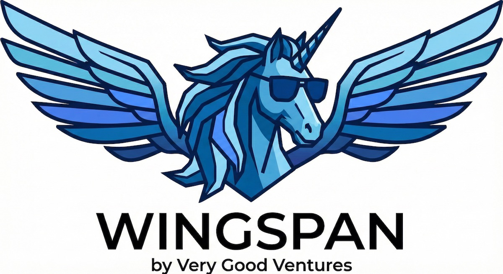

# VGV Wingspan

[![Very Good Ventures][logo_white]][very_good_ventures_link_dark]
[![Very Good Ventures][logo_black]][very_good_ventures_link_light]

🦋 AI-assisted workflows that follow [Very Good Ventures][vgv_link] best practices and standards.

Developed with 💙 by [Very Good Ventures][vgv_link] 🦄



## Installation

### From the Marketplace

One-line install from your terminal:

```bash
claude plugin marketplace add VeryGoodOpenSource/very-good-claude-code-marketplace && claude plugin install vgv-wingspan
```

Or inside an active Claude Code session, run these as **two separate commands** (the second only after the first completes):

1. Add the marketplace:

   ```text
   /plugin marketplace add VeryGoodOpenSource/very-good-claude-code-marketplace
   ```

2. Install the plugin:

   ```text
   /plugin install vgv-wingspan
   ```

## Getting Started

Wingspan follows a four-phase workflow: **brainstorm**, **plan**, **build**, and **review**. Each phase produces artifacts that feed into the next, so you can clear context between steps without losing work. You can invoke skills explicitly with slash commands or let them activate automatically from natural language — just describe what you need and the right skill will trigger.

### 1. `/brainstorm`

Start here. Describe the problem or idea — the bigger and more open-ended, the more value brainstorm adds:

```text
/brainstorm how should we add authentication to this app?
```

Providing context up front produces much better results than invoking `/brainstorm` on its own. This opens a collaborative dialogue to explore requirements, constraints, and approaches. The output is saved to `docs/brainstorm/` so the next phase can pick it up.

### 2. `/plan`

Once you're happy with the brainstorm, turn it into an actionable implementation plan:

```text
/plan add email/password and OAuth login using the auth approach from our brainstorm
```

This reviews your codebase, references the brainstorm, runs a mandatory quality pass on the draft, and produces a phased, step-by-step plan saved to `docs/plan/`. Large plans are split into phases so `/build` can execute one phase per context window.

### 3. `/build`

Execute the plan — write code, write tests, run quality review, and open a PR:

```text
/build docs/plan/add-authentication.md
```

### 4. `/quality-review`

Runs specialized agents in parallel — VGV standards, architecture, test quality, and simplicity. Findings land in one consolidated report with stable `FINDING-NN` ids, and the chat summary mirrors it so you can act on any finding by number. Catches issues before they reach PR.

As simple as this:

```text
/quality-review
```

## Better Together: Working With The Very Good AI Flutter Plugin

Wingspan and the [Very Good AI Flutter Plugin](https://github.com/VeryGoodOpenSource/vgv-ai-flutter-plugin) are designed as complementary layers of VGV's AI-assisted engineering stack. The Flutter Plugin embeds battle-tested best practices — architecture patterns, accessibility, testing, performance, and security — directly into Claude Code, so AI-generated code follows VGV's production-quality standards from the first line.

Wingspan operates at a higher level, orchestrating agentic workflows across the full software development lifecycle: planning, code review, brainstorming, and cross-tool coordination. Together, they create a system where Wingspan handles the what and when of engineering work while the Flutter Plugin ensures the how meets enterprise-grade standards — meaning teams don't just move faster, they move faster in the right direction.

### Tips

- **Clear context between phases.** At the end of each phase, Wingspan offers a "Clear context and [next step]" option. Use it — a fresh context window produces better results.
- **You can skip phases.** Have a simple bug fix? Jump straight to `/build` with a description. Already know exactly what you want? Start at `/plan`.
- **Iterate within a phase.** Use `/refine-approach` to tighten a brainstorm or plan before moving on.

## Skills Reference

| Skill | Command | Description |
|-------|---------|-------------|
| [**Brainstorm**](skills/brainstorm/SKILL.md) | `/brainstorm <feature or idea>` | Explore requirements and approaches through collaborative dialogue |
| [**Refine Approach**](skills/refine-approach/SKILL.md) | `/refine-approach` | Review and refine brainstorms or plans before proceeding |
| [**Plan**](skills/plan/SKILL.md) | `/plan <feature, bug fix, or improvement>` | Transform brainstorm output into a reviewed, phased implementation plan |
| [**Plan Technical Review**](skills/plan-technical-review/SKILL.md) | `/plan-technical-review <plan path>` | Review an externally-authored plan — plans from `/plan` are already reviewed during creation |
| [**Build**](skills/build/SKILL.md) | `/build <plan file path>` | Execute a plan — write code and tests, run quality review, ship a PR |
| [**Quality Review**](skills/quality-review/SKILL.md) | `/quality-review [path]` | Run quality review agents on demand — assess code quality and identify issues |
| [**Hotfix**](skills/hotfix/SKILL.md) | `/hotfix <bug description>` | Apply a minimal, targeted fix for emergency bugs — enforces review and testing without brainstorm or planning |
| [**Create**](skills/create/SKILL.md) | `/create <what to create>` | Scaffold a new project by routing to the right companion plugin |
| [**Create PR**](skills/create-pr/SKILL.md) | `/create-pr` | Validate (formatter, linter, tests, and CI checks), stage, commit, push, and open a pull request on the project's Git hosting platform — aborts on any failure |
| [**Rebase**](skills/rebase/SKILL.md) | `/rebase` | Rebase the current feature branch onto the base branch to stay up-to-date |
| [**Debrief**](skills/debrief/SKILL.md) | `/debrief <incident or context>` | Produce a structured post-incident analysis — timeline, root cause, and actionable follow-ups |

## Agents

Wingspan ships subagents that Claude Code dispatches as isolated, specialized reviewers. Unlike skills, agents are **not** invoked as slash commands — the workflow skills dispatch them automatically, or you can ask Claude to run one by name (e.g. "review my changes with the vgv-review-agent").

| Agent | Description |
| ----- | ----------- |
| [**VGV Review**](agents/codebase-review/vgv-review-agent.md) | Reviews code against Very Good Ventures engineering standards — architecture, state management conventions, testing quality, and code simplicity |
| [**Code Simplicity Review**](agents/codebase-review/code-simplicity-review-agent.md) | Final review pass to ensure code is as simple and minimal as possible — identifies YAGNI violations and simplification opportunities |
| [**Codebase Review**](agents/codebase-review/codebase-review-agent.md) | Conducts a thorough review of the codebase — structure, conventions, and consistent pattern usage |
| [**Architecture Review**](agents/quality-review/architecture-review-agent.md) | Validates project architecture post-implementation — layer separation, dependency direction, and package structure |
| [**Test Quality Review**](agents/quality-review/test-quality-review-agent.md) | Reviews test coverage and quality — verifies every testable unit has proper tests following VGV conventions |
| [**PR Readiness Review**](agents/quality-review/pr-readiness-review-agent.md) | Checks formatting, static analysis, debug artifacts, and commit hygiene before a pull request opens |
| [**Plan Splitting**](agents/analysis/plan-splitting-agent.md) | Analyzes implementation plans for scope and recommends splitting large plans into independently-mergeable PRs |
| [**User Flow Analysis**](agents/analysis/user-flow-analysis-agent.md) | Analyzes specs and feature descriptions for flow completeness, edge cases, and requirement gaps |
| [**Best Practices Research**](agents/research/best-practices-research-agent.md) | Researches best practices for the project's technology stack — VGV conventions first, then official docs and industry standards |
| [**Official Docs Research**](agents/research/official-docs-research-agent.md) | Gathers documentation for frameworks, libraries, or dependencies — official docs, version constraints, and implementation patterns |

## Hooks

Wingspan includes a `PreToolUse` hook that detects your project type and recommends companion plugins you haven't installed yet.

| Hook | Trigger | Behavior |
| ---- | ------- | -------- |
| **Recommend Plugins** (`recommend-plugins.sh`) | PreToolUse (`Read`/`Glob`/`Grep`) | Scans detection rules in `hooks/recommendations/`, recommends missing companion plugins once per session; non-blocking |

### Prerequisites

- **jq** — used to parse recommendation rules; the hook is skipped gracefully if `jq` is not installed

## Contributing

See [CONTRIBUTING.md](CONTRIBUTING.md) for how to add or improve skills, test your changes locally, and open a pull request. All contributors are expected to follow the [Code of Conduct](CODE_OF_CONDUCT.md).

[vgv_link]: https://verygood.ventures
[very_good_ventures_link_dark]: https://verygood.ventures#gh-dark-mode-only
[very_good_ventures_link_light]: https://verygood.ventures#gh-light-mode-only
[logo_black]: https://raw.githubusercontent.com/VGVentures/very_good_brand/main/styles/README/vgv_logo_black.png#gh-light-mode-only
[logo_white]: https://raw.githubusercontent.com/VGVentures/very_good_brand/main/styles/README/vgv_logo_white.png#gh-dark-mode-only
