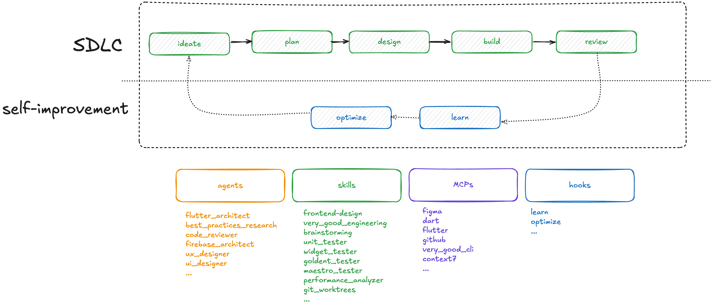

# Wingspan

AI-assisted workflows that follow Very Good Ventures best practices and standards.


## Installation

### From the marketplace

**Single session** — loads the plugin for the current session only:

```bash
cd /to/your/project
claude --plugin VeryGoodOpenSource/wingspan
```

**Persistent** — installs the plugin so it loads automatically on every session:

```bash
cd /to/your/project
claude
# then inside Claude Code:
/plugin marketplace add VeryGoodOpenSource/wingspan
/plugin install wingspan@wingspan-marketplace
```

### For local development

```bash
git clone git@github.com:VeryGoodOpenSource/wingspan.git
```

**Single session** — loads the plugin for the current session only:

```bash
cd /to/your/project
claude --plugin-dir <wingspan-path>/plugins/wingspan
```

**Persistent** — installs the plugin so it loads automatically on every session:

```bash
cd /to/your/project
claude
# then inside Claude Code:
/plugin marketplace add <wingspan-path>
/plugin install wingspan@wingspan-marketplace
```

## Getting Started

Wingspan follows a three-phase workflow: **brainstorm**, **plan**, **build**. Each phase produces artifacts that feed into the next, so you can clear context between steps without losing work.

### 1. Brainstorm

Start here. Describe what you want to build and run:

```text
/brainstorm
```

This opens a collaborative dialogue to explore requirements, constraints, and approaches. The output is saved to `docs/brainstorm/` so the next phase can pick it up.

### 2. Plan

Once you're happy with the brainstorm, turn it into an actionable implementation plan:

```text
/plan
```

This reviews your codebase, references the brainstorm, and produces a step-by-step plan saved to `docs/plan/`.

### 3. Build

Execute the plan — write code, write tests, run quality review, and open a PR:

```text
/build
```

### Tips

- **Clear context between phases.** At the end of each phase, Wingspan offers a "Clear context and [next step]" option. Use it — a fresh context window produces better results.
- **You can skip phases.** Have a simple bug fix? Jump straight to `/build` with a description. Already know exactly what you want? Start at `/plan`.
- **Iterate within a phase.** Use `/refine-approach` to tighten a brainstorm or plan before moving on.

## Skills Reference

| Skill | Command | Description |
|-------|---------|-------------|
| **Brainstorm** | `/brainstorm` | Explore requirements and approaches through collaborative dialogue |
| **Plan** | `/plan` | Transform brainstorm output into a structured implementation plan |
| **Build** | `/build` | Execute a plan — write code and tests, run quality review, ship a PR |
| **Create Branch** | `/create-branch` | Set up a workspace (branch or worktree) before writing artifacts |
| **Plan Technical Review** | `/plan-technical-review` | Validate that a plan meets requirements and follows best practices |
| **Refine Approach** | `/refine-approach` | Review and refine brainstorms or plans before proceeding |

## Vision


